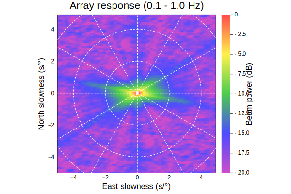
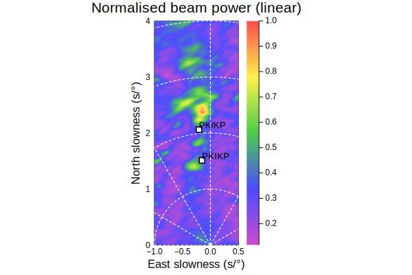

# Beamforming

Beamforming is a Julia module for the array analysis of seismic
data, using [Seis.jl](https://github.com/anowacki/Seis.jl).

## Build status
[](https://travis-ci.org/anowacki/Beamforming.jl)
[](https://ci.appveyor.com/project/AndyNowacki/beamforming-jl/branch/master)
[](https://coveralls.io/github/anowacki/Beamforming.jl?branch=master)


## Installation

```julia
julia> ] # press ']' to enter pkg mode

(v1.4) pkg> add https://github.com/anowacki/Geodesics.jl https://github.com/anowacki/Seis.jl https://github.com/anowacki/Beamforming.jl
```

Beamforming.jl requires Julia v1.6 or above.

## Usage overview

The main functions exported are:

- For traditional beamforming:
  - `array_response`: Compute the array response function for a set
    of stations
  - `beamform`: Compute the beam power across a grid of slowness points
    (as in f–k analysis)
  - `vespagram`: Compute a slowness vespagram
- For cross-correlation beamforming:
  - `crosscorrelation_array_response`
  - `crosscorrelation_beamform`

Docstrings are exhaustive, and can be consulted for usage of these
functions.  To bring up docstrings in the REPL, type `?` followed
by the name of the function and press return.

### Array response
The array response for a set of stations can be computed like so:
```julia
using Beamforming, Seis
t = sample_data(:array); # 60 UK stations
# Array response parameters
arf = array_response(t,
                     5,   # Maximum slowness in s/°
                     0.1, # Slowness grid spacing
                     0.1, # Minimum frequency in Hz
                     1,   # Maximum frequency
                     0.1, # Frequency spacing
                     true # `true` for s/° slowness; `false` for s/km
                     )
plot(arf, powscale=:dB)   # If Plots is installed
```


### Beamforming
Beamforming can be performed like so:
```julia
bf = beamform(t,
              1100, # Start time in s
              1160, # End time in s
              -1,   # Minimum east slowness in s/°
              0.5,  # Maximum east slowness
              0,    # Minimum north slowness
              4,    # Maximum north slowness
              0.01  # Slowness spacing
              )
plot(bf, phases=["PKiKP", "PKIKP"])
```


### Vespagrams
Compute a vespagram like so:
```julia
vesp = vespagram(t,
                 1110, # Start time in s
                 1150, # End time
                 0,    # Minimum slowness in s/°
                 4,    # Maximum slowness
                 0.01, # Slowness spacing
                 )
plot(vesp, phases=["PKiKP", "PKIKP"], clim=(-1,1))
```


## Optional extras

### Plotting
If you have installed Plots to your environment, then you can easily
create plots as shown above.

For more help on plotting commands provided in this package, call up
the online help for `Beamforming.plot`:

```julia
help?> Beamforming.plot
```

### Travel times
To plot the predicted location in slowness and time of arrivals,
you can install [SeisTau.jl](https://github.com/anowacki/SeisTau.jl).
(See the [installation notes](https://github.com/anowacki/SeisTau.jl#installation) for more.)

Simply do `using SeisTau`, then the `phases` option to `plot` will
enable easy predicted phase arrival plotting for `BeamformGrid`s
and `VespaGrid`s, produced respectively by `beamform` and
`vespagram`.
